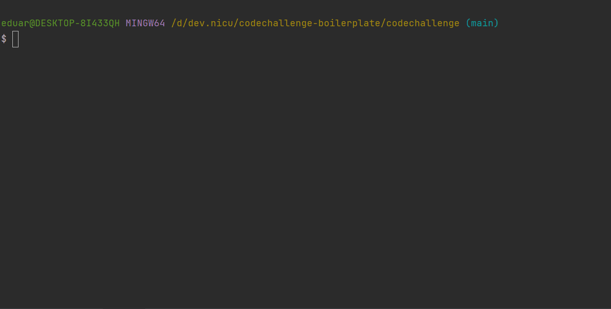

# Machine Requirements

For this challenge to run, you'll have to have Docker running or have PHP running locally on your machine.

This README assumes you're using Docker to run the challenge. 

1. Start the Docker containers; `docker compose up -d`

2. Run your tests; `docker compose exec app vendor/bin/phpunit .` 

3. Stop the docker containers; `docker compose down`

Without further ado - good luck with the challenge and, even more importantly, HAVE FUN!

# Assumptions and design decisions

The assumption I'm making is that the vehicles will arrive in order and there is only one entrance for the garage.

Another assumption is that the drivers will occupy the first available space they are allowed to park. But in the future
the owners might introduce different routes or rules to optimize how space is allocated.

For this first prototype I've created a simple CLI application where the user sets up the garage 
and introduces the vehicles.

I've separated the domain from the presentation layer by adding two namespaces. This structure will serve as a hint for how to extend the application.

* Domain -  business logic is defined
* Presentation - user interface is defined

To keep the dependencies minimal I've only used symfony/console component.

Test coverage is ensured for both the domain and the interface.

## Improvements and possibilities to extend this application

* The garage owner might want to organize some routing to direct cars and motorcycles to higher floors. In this case 
the ordering in the ```$parkingRules``` can be changed and test updated. Relative effort - S
* The configuration can be persisted or read from a config file. In this case some infrastructure logic can be added to
read/write from a json file and configure the garage. Relative effort - M
* A different convention for naming floors might be needed (e.g. A, B, C) or more vehicle types could be added. 
Rather than using class constants, enums can be implemented. Relative effort - S
* More logic can be added that will result in extra classes. Introduce dependency injection. Relative effort - M
* Scale the system to multiple garages and persist rules in a database. Relative effort - L/XL
* Investigate the deprecation warning when running tests with dot directory. This doesn't reproduce when running on tests/ or individual test cases

## How to run the program

Clone repo
```
git clone https://github.com/eduardbudacu/parking-app.git
```

```
cd parking-app
```

Start containers
```
docker compose up -d
```
Install dependencies 
```
docker compose exec app composer install
```
Notice: sometimes on my local machine some of the dependencies of phpunit were not extracted, so I had run the command twice

Run tests
```
docker compose exec app vendor/bin/phpunit .
```
Execute program
```bash
docker compose exec app php console.php app:parking
```

## Demo


